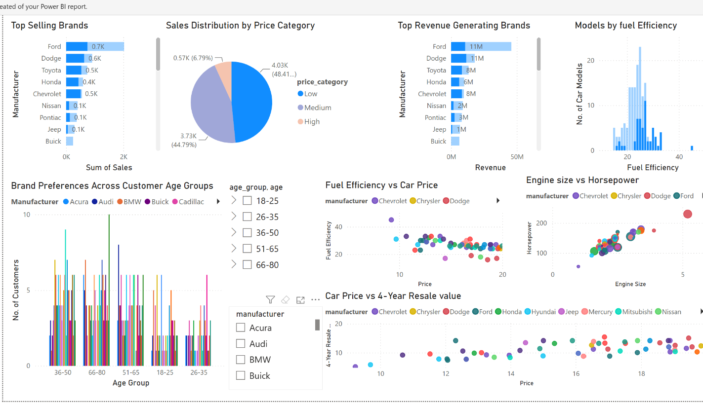

# Car Sales Business Intelligence Dashboard

A Power BI business-intelligence project for exploring vehicle-sales data and turning it into decision-ready insights for inventory planning, customer segmentation, pricing, and marketing analysis.


## Dashboard Preview



The repository includes the final Power BI report together with a cleaned Python notebook that documents the data-preparation workflow.

---

## Project Objective

The project transforms raw vehicle-sales data into an analytical dataset and interactive dashboard for business decision support.

The source dataset used in the notebook contains:

- **157 vehicle records**
- **15 original columns**
- manufacturer and model information
- sales volume
- four-year resale value
- vehicle type
- price
- engine size and horsepower
- vehicle dimensions and curb weight
- fuel capacity and fuel efficiency
- latest launch date

---

## Dashboard Pages

### 1. Dashboard

The main analytical page includes:

- **Top Selling Brands**
- **Sales Distribution by Price Category**
- **Top Revenue Generating Brands**
- **Models by Fuel Efficiency**
- **Brand Preferences Across Customer Age Groups**
- **Fuel Efficiency vs Car Price**
- **Engine Size vs Horsepower**
- **Car Price vs 4-Year Resale Value**
- manufacturer and age-group filtering

Together, these visuals support comparisons across sales performance, revenue, pricing, efficiency, vehicle characteristics, resale value, and customer segments.

### 2. KPI Summary

The KPI page presents three headline measures:

| KPI | Dashboard value |
|---|---:|
| Total Sales Volume | 8.32M |
| Total Revenue | 181.53M |
| Average Car Price | 27.33K |

A short narrative section beneath the KPI cards interprets the headline figures for business users.

---

## Business Questions Explored

The dashboard helps answer questions such as:

- Which manufacturers contribute the highest sales volume?
- Which brands generate the most revenue?
- How are sales distributed across low-, medium-, and high-price categories?
- How does fuel efficiency vary across vehicle models and prices?
- What relationship exists between engine size and horsepower?
- How does vehicle price compare with four-year resale value?
- How do manufacturer preferences vary across customer age groups?

---

## Data Preparation Workflow

The notebook preserves the core preparation logic used in the project.

### 1. Load the source dataset

The notebook expects:

```text
data/Car_sales.csv
```

### 2. Standardize missing-value placeholders

The following placeholders are converted to missing values:

```text
.
NA
N/A
na
```

### 3. Convert analytical fields to numeric types

The workflow converts these columns to numeric values:

- 4-year resale value
- Price in thousands
- Engine size
- Horsepower
- Wheelbase
- Width
- Length
- Curb weight
- Fuel capacity
- Fuel efficiency

### 4. Handle missing numeric values

Missing values in the numeric fields are filled using the **median of the corresponding column**.

### 5. Create price categories

A derived `Price Category` field groups vehicles into:

| Category | Price in thousands |
|---|---:|
| Low | up to 20 |
| Medium | above 20 to 35 |
| High | above 35 |

### 6. Export the cleaned dataset

The notebook can write the prepared dataset to:

```text
data/car_sales_cleaned.csv
```

for loading into Power BI.

---

## Repository Structure

```text
Car-sales-Bi-Dashboard/
├── data/
│   └── README.md
├── notebooks/
│   └── car_sales_data_preparation.ipynb
├── .gitignore
├── LICENSE
├── README.md
├── car_sales_dashboard.pbix
├── dashboard_overview.png
└── requirements.txt
```

---

## Run the Data Preparation Notebook

Install the Python dependencies:

```bash
python -m pip install -r requirements.txt
```

Place the source dataset at:

```text
data/Car_sales.csv
```

Then open and run:

```text
notebooks/car_sales_data_preparation.ipynb
```

---

## Power BI Report

The final report is included as:

```text
car_sales_dashboard.pbix
```

Open it in **Microsoft Power BI Desktop** to interact with the report, filters, and KPI page.

---

## Dataset Note

The raw CSV is not redistributed in this repository because the original dataset source and redistribution terms have not yet been documented.

See [data/README.md](data/README.md) for the expected schema.

---

## Skills Demonstrated

- Power BI dashboard development
- business-intelligence reporting
- dashboard and KPI design
- Python data cleaning
- pandas and NumPy
- missing-value treatment
- feature engineering
- customer segmentation analysis
- analytical dataset preparation
- business-oriented data storytelling

---

## Portfolio Role

This project demonstrates **Business Intelligence and Data Analytics**, complementing the machine-learning, computer-vision, software, and geospatial work in the wider portfolio.

---

## Author

**Oscar Muchiri**

Computer Scientist | Machine Learning • Software Engineering • Geospatial Systems
